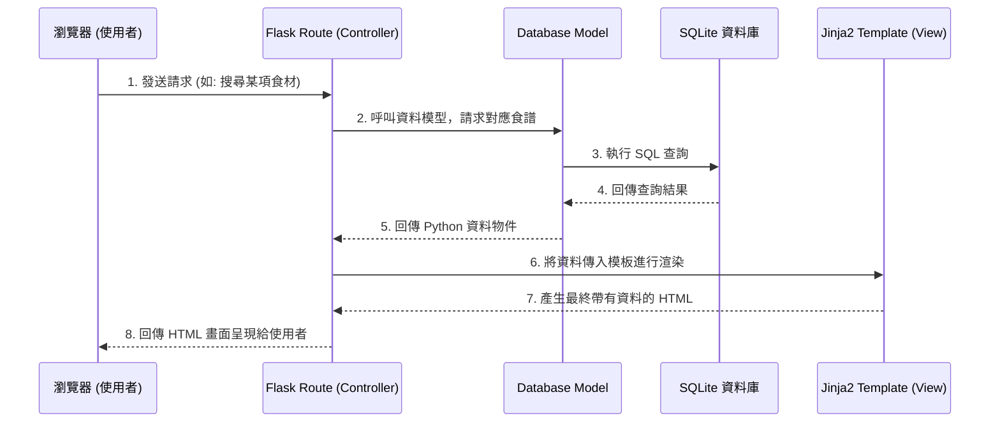

# 系統架構文件 (Architecture) - 食譜收藏系統

## 1. 技術架構說明
本專案為個人使用的「食譜收藏系統」，為了達到輕量、快速開發與容易維護的目標，整體架構基於 Python 的 Flask 微框架建立。

- **後端框架：Python + Flask**
  - 使用 Flask 處理所有的 HTTP 請求與業務邏輯（例如：新增食譜、搜尋邏輯）。因為需求單純且為個人使用，輕量級的 Flask 相對適合。
- **模板引擎：Jinja2**
  - 專案不採前後端分離開發，而是直接由 Flask 結合 Jinja2 在伺服器端渲染 HTML 畫面後回傳給使用者，減少前後端開發與溝通成本。
- **資料庫：SQLite**
  - 使用 SQLite 儲存食譜資料、食材與標籤分類。由於專案為單機個人使用，SQLite 無需額外配置伺服器，是最輕巧便利的選擇。

**MVC 模式說明：**
- **Model (模型)**：負責定義食譜、食材、分類的資料模型，並且處理與 SQLite 資料庫的存取互動。
- **View (視圖)**：Jinja2 HTML 模板與前端靜態資源（CSS/JS），負責將資料轉化為畫面呈現給使用者。
- **Controller (控制器)**：Flask 的路由函式 (Routes)，負責接收使用者的請求、向 Model 索取資料、處理邏輯後將整理好的資料傳給 View 進行渲染。

## 2. 專案資料夾結構

建議的資料夾結構與各部分職責如下：

```text
web_app_development/
├── app/
│   ├── models/            ← 資料庫模型 (定義資料表結構與資料庫互動邏輯)
│   ├── routes/            ← Flask 路由 (Controller，處理各頁面以及 API 請求)
│   ├── templates/         ← Jinja2 HTML 模板 (View，負責前端畫面結構)
│   ├── static/            ← 靜態資源 (存放 CSS 樣式表、JavaScript 與圖片)
│   └── __init__.py        ← 初始化 Flask 應用程式的工廠函式
├── instance/
│   └── database.db        ← SQLite 資料庫檔案 (實際儲存資料的地方，不進版控)
├── docs/
│   ├── PRD.md             ← 產品需求文件
│   └── ARCHITECTURE.md    ← 系統架構文件 (本文件)
├── app.py                 ← 系統進入點 (啟動伺服器的主要腳本)
├── requirements.txt       ← Python 套件依賴清單
└── README.md              ← 專案說明與啟動指南
```

## 3. 元件關係圖

以下展示使用者如何透過瀏覽器與本系統互動的資料流：



## 4. 關鍵設計決策

1. **不採前後端分離架構**
   - **原因**：根據 PRD 此專案為個人使用之 MVP，優先考量開發速度與簡潔度。使用 Flask 搭配 Jinja2 伺服器渲染可大幅降低開發門檻，也省去了需另外實作前端專案 (如 React/Vue) 與處理跨域 (CORS)、API 驗證的複雜度。
2. **採用 SQLite 作為唯一資料庫**
   - **原因**：食譜等文字資料量小且無高併發需求，SQLite 以單一檔案的形式運作，不需額外架設與維護關聯式資料庫伺服器 (如 MySQL)，且極度方便備份與搬移。
3. **根據食材推薦演算法的實作方式**
   - **原因**：初期 MVP 階段將使用簡單的 SQL `LIKE` 或 `IN` 語法進行食材關鍵字比對，以確保核心功能快速上線驗證；未來若食譜與食材種類增加，可再考慮導入標籤系統或自訂權重演算法。
4. **將業務邏輯切分為 models 與 routes 資料夾**
   - **原因**：維持良好的應用程式結構有助於後續維護。避免所有的邏輯都集中在單一的 `app.py` 內，確保日後擴充功能（例如：食譜圖片上傳、匯入匯出功能）時，專案結構能有良好的延展性且容易理解。
