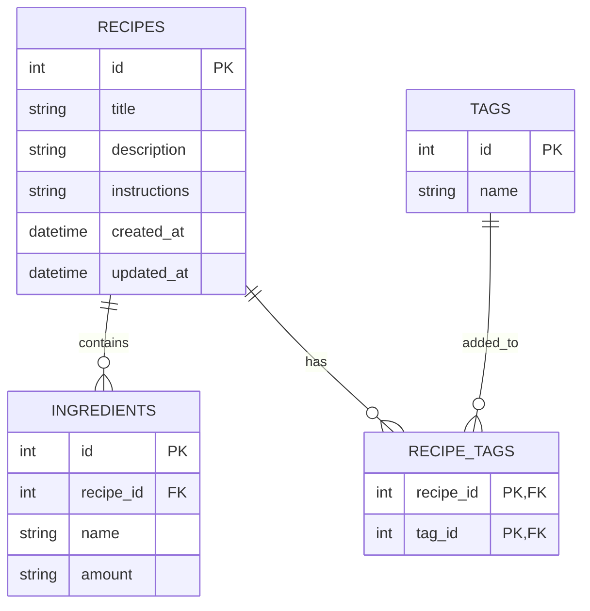

# 資料庫設計文件 - 食譜收藏系統

根據產品需求與系統架構，本專案採用 SQLite 作為資料庫，並規劃以下資料表來儲存食譜、食材與分類標籤資訊。

## 1. ER 圖（實體關係圖）

## 2. 資料表詳細說明

### recipes (食譜表)
儲存食譜的主體資訊。
- `id` (INTEGER, PK): 唯一識別碼，自動遞增。
- `title` (TEXT, 必填): 食譜名稱。
- `description` (TEXT, 選填): 食譜簡介。
- `instructions` (TEXT, 選填): 製作步驟說明。
- `created_at` (DATETIME): 建立時間。
- `updated_at` (DATETIME): 最後更新時間。

### ingredients (食材表)
儲存每道食譜對應的所需食材。與 `recipes` 為多對一關聯。
- `id` (INTEGER, PK): 唯一識別碼，自動遞增。
- `recipe_id` (INTEGER, FK): 對應的食譜 ID。
- `name` (TEXT, 必填): 食材名稱 (如：雞蛋、蘋果)。
- `amount` (TEXT, 選填): 食材數量與單位 (如：2 顆、300g)。

### tags (標籤與分類表)
儲存系統內的分類或標籤 (如：中式、甜點)。
- `id` (INTEGER, PK): 唯一識別碼，自動遞增。
- `name` (TEXT, 必填): 標籤名稱，設定為 UNIQUE，確保沒有重複的分類。

### recipe_tags (食譜與標籤關聯表)
處理食譜與標籤之間的多對多 (Many-to-Many) 關係。
- `recipe_id` (INTEGER, PK, FK): 對應的食譜 ID。
- `tag_id` (INTEGER, PK, FK): 對應的標籤 ID。

## 3. SQL 建表語法
完整的建表語法請參考專案目錄下的 `database/schema.sql` 檔案。

## 4. Python Model 程式碼
由於系統基於 Flask 且訴求輕量，本專案直接使用 Python 內建的 `sqlite3` 套件來進行資料庫操作。Model 的 CRUD 方法已實作並存放於 `app/models/` 資料夾下：
- `app/models/db.py`: 負責處理資料庫連線與取得 DB 操作 Cursor，以及初始化資料表。
- `app/models/recipe.py`: 負責對食譜做 CRUD，並同時處理關連的食材與標籤邏輯。
