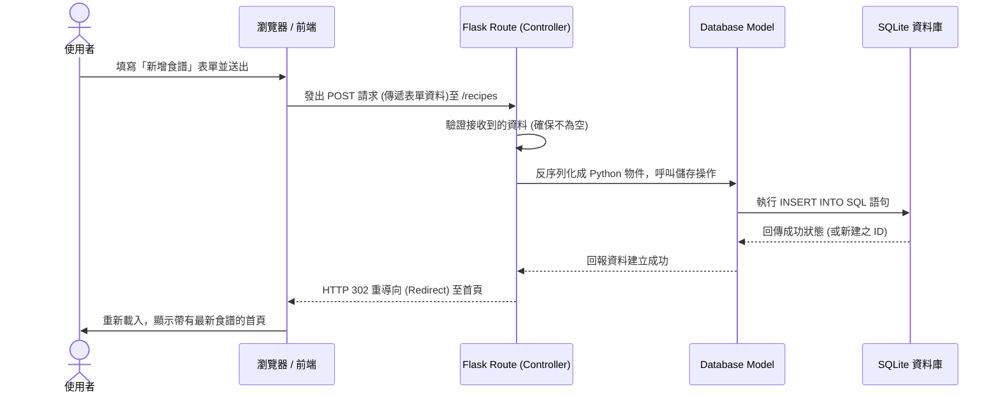

# 系統流程圖與功能對照表 - 食譜收藏系統

根據產品需求文件 (PRD) 以及系統架構文件 (ARCHITECTURE)，以下為系統的使用者操作流程、資料流動序列圖，以及功能路徑對照表。

## 1. 使用者流程圖（User Flow）

此流程圖涵蓋使用者從進入網站開始的主要操作路徑與分支，幫助開發者釐清畫面流動與使用者行為。

```mermaid
flowchart LR
    A([使用者開啟網頁]) --> B[首頁 / 食譜總覽列表]
    
    B --> C{選擇操作}
    
    C -->|新增食譜| D[新增食譜頁面 (表單)]
    D -->|送出表單| E[資料庫建立資料]
    E --> B
    
    C -->|查看特定食譜| F[瀏覽食譜詳細內容]
    F --> G{進階選項}
    G -->|編輯| H[編輯食譜頁面 (表單)]
    H -->|儲存變更| E
    G -->|刪除| I[刪除食譜邏輯]
    I --> B
    
    C -->|關鍵字搜尋| J[輸入搜尋字串]
    J --> K[顯示搜尋結果列表]
    K --> F
    
    C -->|根據食材推薦| L[輸入現有庫存食材]
    L --> M[顯示推薦食譜結果]
    M --> F
```

## 2. 系統序列圖（Sequence Diagram）

以下描述核心功能「新增食譜」時的內部資料流與各元件互動狀況。



## 3. 功能清單與對照表

將 PRD 的主要功能需求具體地對應到網頁路由與 HTTP 操作，方便後端實作框架。

| 功能名稱 | 處理邏輯或畫面說明 | HTTP Method | URL 路徑規劃 |
|---------|------------------|-------------|-------------|
| 列表與首頁 | 顯示所有被收藏的食譜清單 | GET | `/` 或 `/recipes` |
| 新增介面 | 顯示給使用者填寫食譜內容的 HTML 視圖 | GET | `/recipes/new` |
| 新增處理 | 接收前端表單並將資料存入資料庫 | POST | `/recipes` |
| 查看細節 | 顯示某一特定食譜的完整資訊 | GET | `/recipes/<id>` |
| 編輯介面 | 顯示帶有原始資料的表單供修改 | GET | `/recipes/<id>/edit` |
| 編輯處理 | 接收修改後的資料並 UPDATE 資料庫 | POST | `/recipes/<id>/edit` |
| 刪除處理 | 接收刪除請求並 DELETE 資料庫紀錄 | POST | `/recipes/<id>/delete` |
| 關鍵字搜尋 | 解析 GET 參數 (如 `?q=蘋果`)，並回傳搜尋結果清單 | GET | `/recipes/search` |
| 食材推薦 | 讓使用者輸入擁有的食材，回傳相符的食譜清單 | GET | `/recipes/recommend` |
